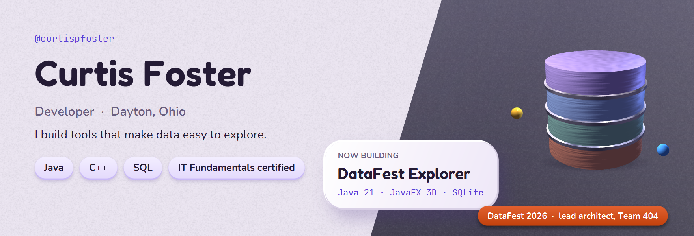
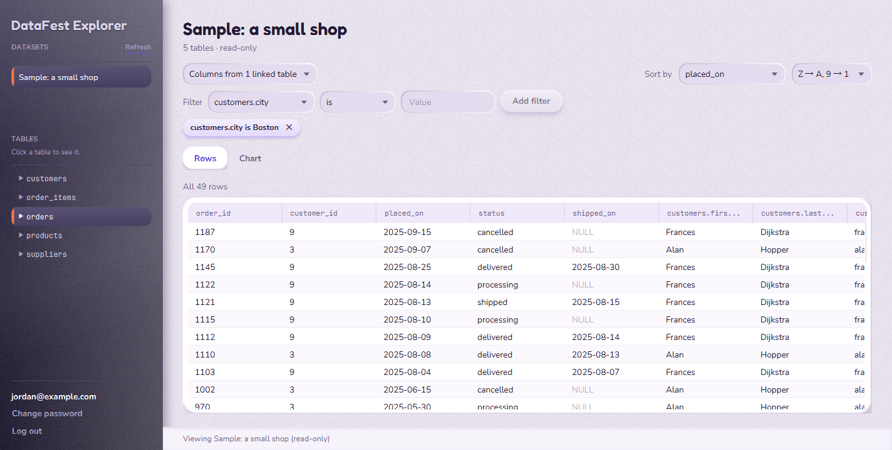
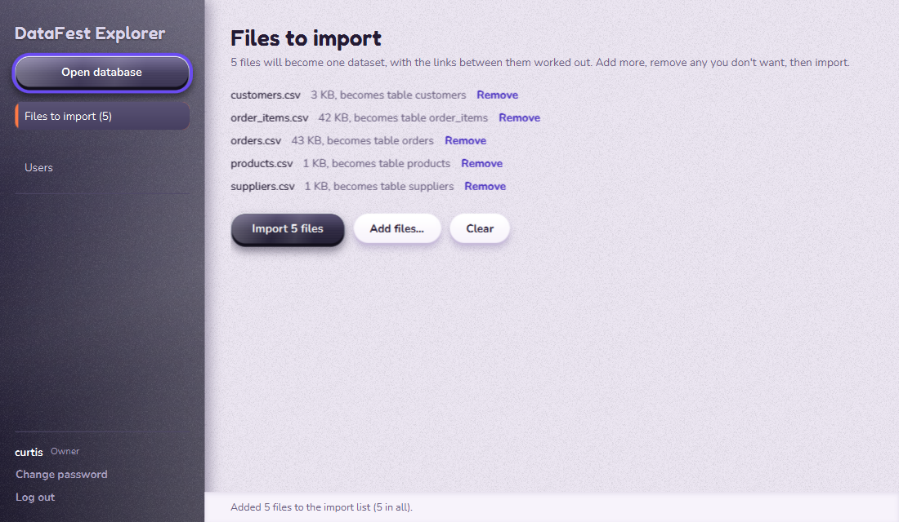
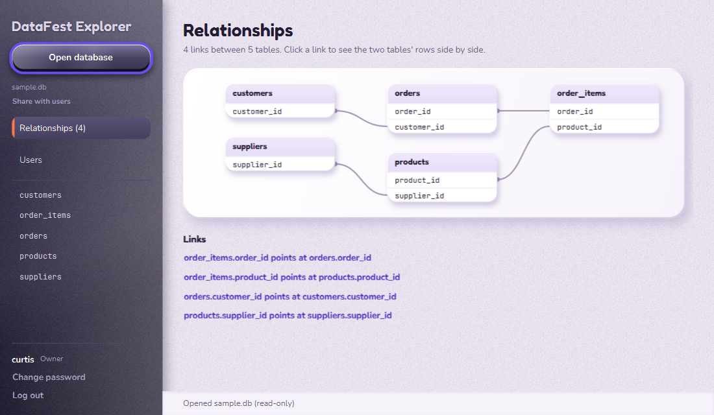

<picture>
  <source media="(max-width: 600px)" srcset="assets/profile-hero-narrow.png">
  
</picture>

I'm Curtis Foster, a developer in Dayton, Ohio, with hands-on experience in Java and C++ and a
certification in IT Fundamentals.

## Languages and tools

**Languages**

<table>
  <tr>
    <td align="center" width="84"> <b>Java</b></td>
    <td align="center" width="84"> <b>C++</b></td>
    <td align="center" width="84"> <b>SQL · SQLite</b></td>
    <td align="center" width="84"> <b>Python</b></td>
  </tr>
  <tr>
    <td align="center" width="84"> <b>TypeScript</b></td>
    <td align="center" width="84"> <b>C#</b></td>
    <td align="center" width="84"> <b>HTML</b></td>
    <td align="center" width="84"> <b>CSS</b></td>
  </tr>
</table>

**Frameworks and tools**

<table>
  <tr>
    <td align="center" width="84"> <b>React</b></td>
    <td align="center" width="84"> <b>ASP.NET Core</b></td>
    <td align="center" width="84"> <b>Vite</b></td>
    <td align="center" width="84"> <b>Maven</b></td>
  </tr>
  <tr>
    <td align="center" width="84"> <b>JUnit</b></td>
    <td align="center" width="84"> <b>Jupyter</b></td>
    <td align="center" width="84"> <b>Git</b></td>
    <td align="center" width="84"> <b>IntelliJ IDEA</b></td>
  </tr>
</table>

Plus JavaFX (including its 3D API) for desktop apps.

## DataFest Explorer

At DataFest my team had a big dataset split across linked tables, and most of us only knew MS Access.
So I built a desktop app where an admin drops in CSV or JSON files, the app works out how the tables
connect by itself, and everyone else explores and charts the data by pointing and clicking, with no SQL.

 

- Streams CSV imports of any size (8 million rows in a few minutes) and finds the foreign keys between files
- Builds each query from the user's clicks, and SQLite computes the bar, line, pie and scatter charts
- Hashes passwords with Argon2id and guards accounts with a user, admin and owner role hierarchy
- A clay and brushed-metal interface with a lit, animated JavaFX 3D database stack on the sign-in screens
- Written in Java 21 and JavaFX with no FXML, on SQLite, with over 170 JUnit tests

**[Download for Windows (1.1.0 Beta)](https://github.com/curtispfoster/curtispfoster/releases/latest)** · no Java install needed  
[Report a bug or suggest an idea](https://github.com/curtispfoster/curtispfoster/issues/new/choose)

## Other work

**[Team 404, DataFest 2026](https://github.com/curtispfoster/404).**
Our team's repository for the ASA DataFest competition, where I was lead architect.
Analysis in Python and Jupyter.

**[Programming Concepts](https://github.com/curtispfoster/Programming-Concepts).**
Object-oriented programming exercises in Java.

What's in it

- Hello World
- Corporates in Circle
- Consecutive Equal Names
- Credit Card Validator
- Investment Value
- Tax Calculator

