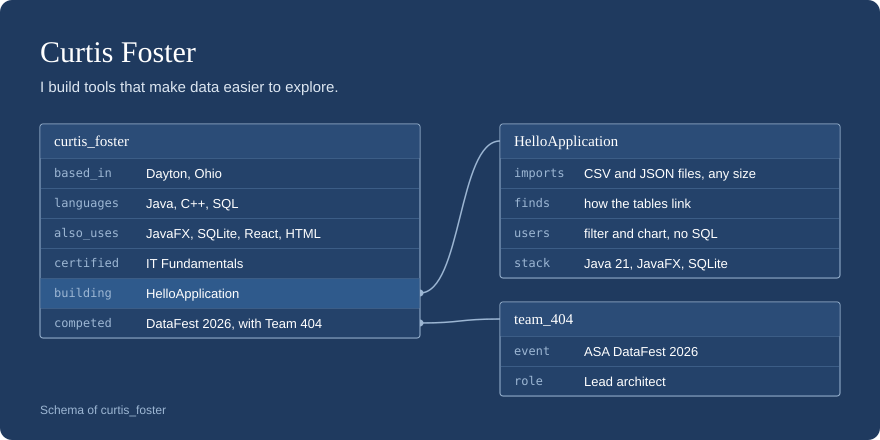

<picture>
  <source media="(max-width: 600px)" srcset="assets/schema-narrow.svg">
  
</picture>

I'm Curtis Foster, a developer in Dayton, Ohio, with hands-on experience in Java and C++ and a
certification in IT Fundamentals.

**Languages and tools:** Java, C++, SQL, SQLite, JavaFX, Maven, JUnit, HTML, React

## HelloApplication

At DataFest my team had a big dataset split across linked tables, and most of us only knew MS Access.
So I built a desktop app where an admin drops in CSV or JSON files, the app works out how the tables
connect by itself, and everyone else explores and charts the data by pointing and clicking, with no SQL.

 

- Streams CSV imports of any size (8 million rows in a few minutes) and finds the foreign keys between files
- Builds each query from the user's clicks, and SQLite computes the bar, line, pie and scatter charts
- Hashes passwords with Argon2id and guards accounts with a user, admin and owner role hierarchy
- Written in Java 21 and JavaFX with no FXML, on SQLite, with over 160 JUnit tests

[Code, setup and more screenshots](https://github.com/curtispfoster/HelloApplication)

## Other work

**[Team 404, DataFest 2026](https://github.com/curtispfoster/404).**
Our team's repository for the ASA DataFest competition, where I was lead architect.
Analysis in Python and Jupyter.

**[Programming Concepts](https://github.com/curtispfoster/Programming-Concepts).**
Object-oriented programming exercises in Java.

What's in it

- Hello World
- Corporates in Circle
- Consecutive Equal Names
- Credit Card Validator
- Investment Value
- Tax Calculator

